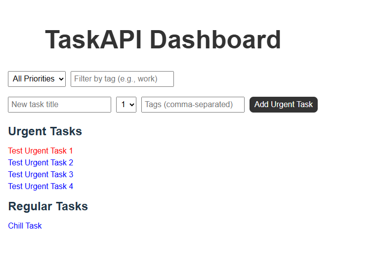

# TaskAPI - My Task Thing

This is a **Task Tracker API** built with Django to mess with tasks—regular ones and urgent ones that have sub-tasks and dependencies. 

## What’s It Got?
- Urgent tasks—priorities (1-5), sub-tasks, dependencies, depth, tags, comments, projects.
- Regular tasks—notes and priorities.
- API for listing, creating, updating, deleting tasks, plus progress calcs (JWT auth locked).
- React mockup—filters, task creation, and detailed views.

## Tech Stack
- Django and REST Framework
- PostgreSQL for data
- React.js (one-time flex)
- Render (free tier struggles)

## Setup
1. Clone it: `git clone https://github.com/yaya-soumah/task_api.git`
2. Add `.env`—database, Redis, secrets.
3. Install: `pip install -r requirements.txt`
4. Migrate: `python manage.py migrate`
5. Run: `python manage.py runserver` 

## Usage
- Get token: `POST http://localhost:8000/v1/api/token/` with `{"username": "you", "password": "pass"}`.
- List tasks: `GET http://localhost:8000/v1/api/urgent-tasks/` or `/api/v1/regular-tasks/` with `Authorization: Bearer your_token`.
- Filter: Add `?priority=3` or `?tag=work`.
- Add task: `POST /api/v1/urgent-tasks/` with `{"title": "Fix Stuff", "priority": 3, "tags": ["work"]}`.
- Update: `PUT /api/v1/urgent-tasks/` with `{"id": 1, "completed": true}`.
- Progress: `GET /api/v1/urgent-tasks/1/progress/`.
- Admin: `http://localhost:8000/admin/` (username/password).
- React mockup: `cd frontend && npm install && npm run dev`.

## React Mockup
My React mockup’s a dashboard—urgent tasks red (priority 3+), regular blue, sub-tasks nested by depth. Filter by priority or tag, add tasks, click for comments, deadlines, or progress (like 60% done). It hits my API’s `/urgent/`, `/regular/`, and `/task_progress/` endpoints to show what’s up—backend’s still my jam. Check it:  

Yaya Soumah made this. More at [github.com/yaya-soumah](https://github.com/yaya-soumah).